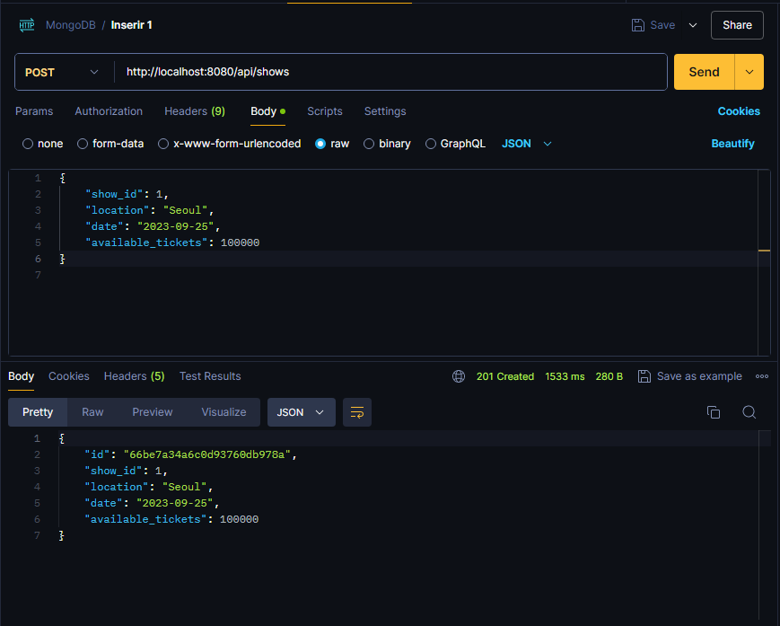
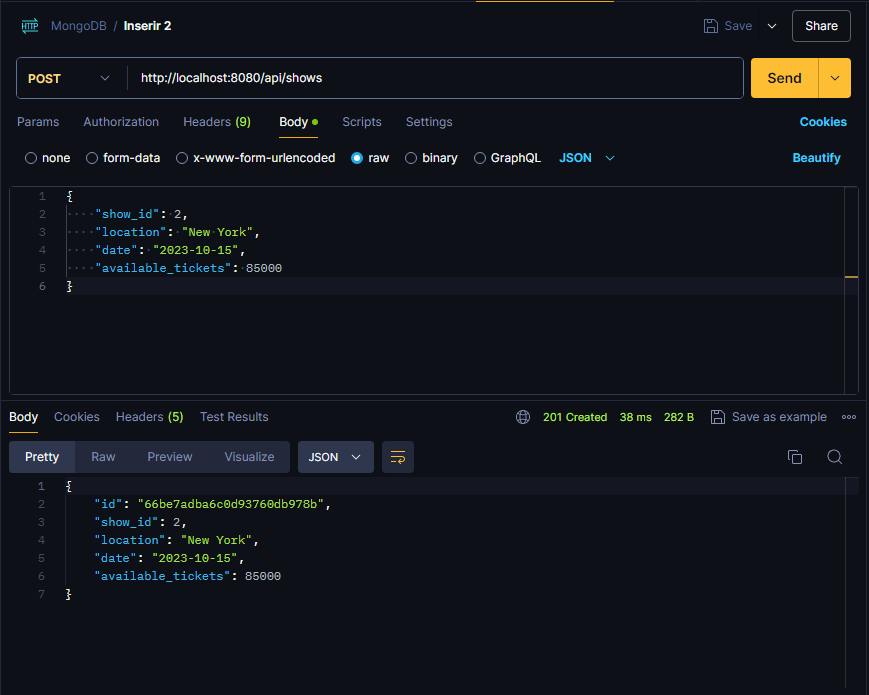
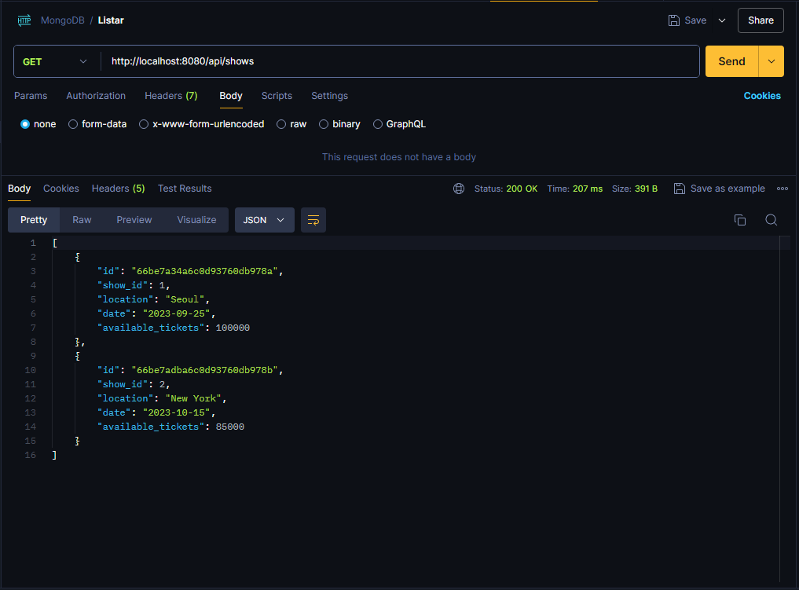

Siga o passo a passo para testar o codigo.

1. Clone o repositório:
    ```bash
    git clone <https://github.com/ximitt/Atividade05TABD.git>
    ```
2. Se Preferir faça o download e abra o projeto com o programa de sua preferencia.
3. Navegue ate:
```src\main\java\org\fundatec\MongoApplication.java ```
4. Execute o programa.
5. Teste com o Postman

   Método: POST

   URL: ```http://localhost:8080/api/shows```
   
    Corpo (JSON):
    ```
   {
   "show_id": 2,
   "location": "New York",
   "date": "2023-10-15",
   "available_tickets": 85000
   } 
    ```
   Imagem 1:

   

   Imagem 2:

   

6. Para listar os elementos inseridos utilize:

   Método: GET

   URL: ```http://localhost:8080/api/shows```

   Imagem 3:

   
